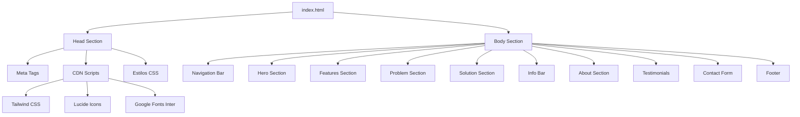
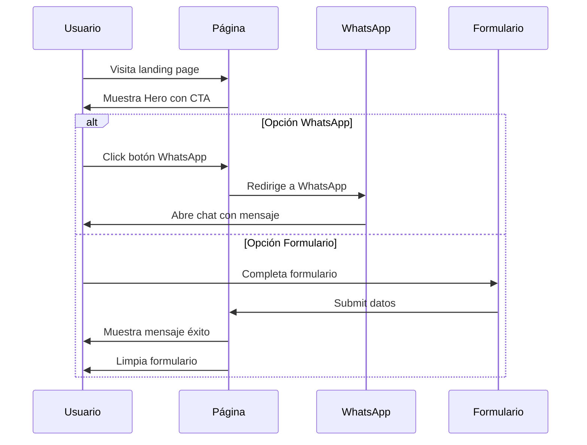
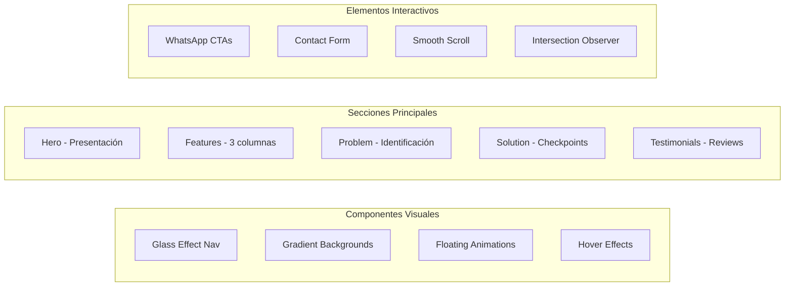
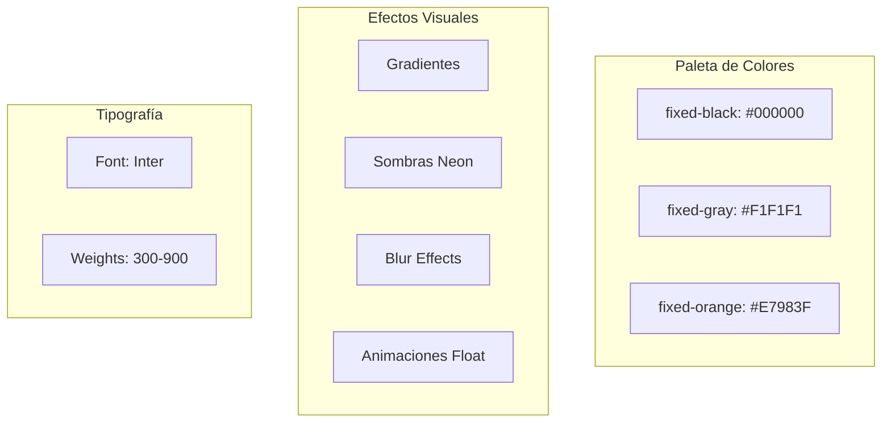
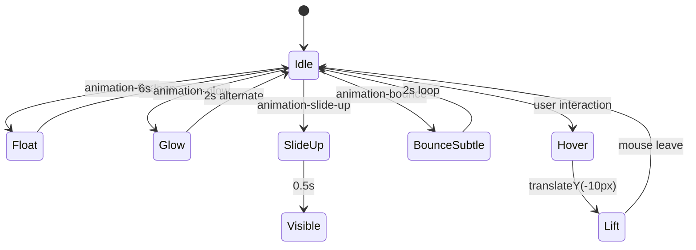
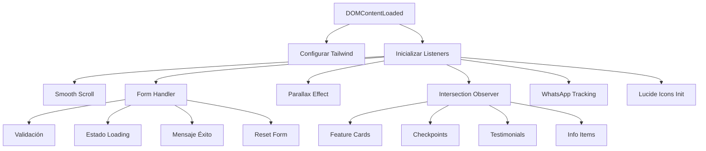
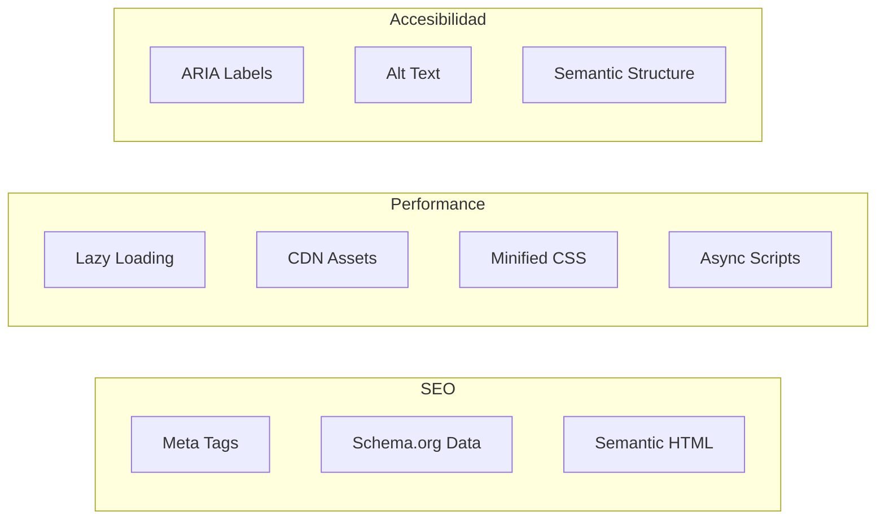

# Documentación Landing Page FIXED 📱💻

## Estructura General del Sitio



## Flujo de Interacción del Usuario



## Arquitectura de Componentes



## Sistema de Colores y Diseño



## Flujo de Datos del Formulario

```mermaid
flowchart TD
    A[Usuario ingresa datos] --> B{Validación}
    B -->|Válido| C[Mostrar "Enviando..."]
    B -->|Inválido| D[Mostrar errores]
    
    C --> E[Simular envío 1.5s]
    E --> F[Mostrar mensaje éxito]
    F --> G[Limpiar formulario]
    F --> H[Auto-ocultar mensaje 5s]
    
    D --> A
```

## Animaciones y Efectos



## Estructura JavaScript



## SEO y Optimización



## Componentes Principales

### 1. **Navigation Bar** (Líneas 159-180)
- Posición fija con efecto glass
- Logo con efecto de brillo en la X
- Botón WhatsApp prominente

### 2. **Hero Section** (Líneas 183-229)
- Gradiente de fondo animado
- Título con efecto gradient-text
- CTAs principales (WhatsApp)
- Elementos flotantes de fondo

### 3. **Features Section** (Líneas 232-308)
- Grid de 3 columnas responsive
- Cards con hover-lift effect
- Iconos con gradientes
- Transiciones suaves

### 4. **Problem Section** (Líneas 311-345)
- Fondo oscuro con elementos flotantes
- Iconos de dispositivos Lucide React
- Animación float en los iconos

### 5. **Solution Section** (Líneas 347-417)
- Checkpoints con iconos verdes
- Grid de 3 columnas
- Efectos hover sutiles

### 6. **Info Bar** (Líneas 420-478)
- 4 columnas con información clave
- Iconos temáticos
- Información de contacto y garantía

### 7. **Contact Form** (Líneas 613-670)
- Formulario con efecto glass
- Validación de campos
- Integración WhatsApp alternativa
- Feedback visual de envío

### 8. **Footer** (Líneas 673-719)
- Información de contacto
- Enlaces rápidos
- Datos estructurados para SEO

## Tecnologías Utilizadas

| Tecnología | Uso | Versión |
|------------|-----|---------|
| HTML5 | Estructura | 5 |
| Tailwind CSS | Estilos | CDN Latest |
| Lucide Icons | Iconografía | Latest |
| JavaScript | Interactividad | ES6+ |
| Google Fonts | Tipografía Inter | Latest |

## Funcionalidades JavaScript

### Smooth Scrolling
- Navegación suave entre secciones
- Comportamiento nativo del navegador

### Form Handler
- Validación de campos
- Estados de loading
- Mensajes de éxito temporales
- Reset automático

### Intersection Observer
- Animaciones on-scroll
- Lazy loading de elementos
- Performance optimizada

### Parallax Effect
- Efecto en hero section
- Velocidad reducida (0.2)
- Mejora visual sutil

## Optimizaciones Implementadas

1. **Performance**
   - Lazy loading de imágenes
   - CDN para assets
   - Minificación de recursos

2. **SEO**
   - Schema.org markup
   - Meta tags optimizados
   - Estructura semántica

3. **UX/UI**
   - Animaciones suaves
   - Feedback visual inmediato
   - Diseño responsive
   - CTAs prominentes

4. **Conversión**
   - Múltiples puntos de contacto WhatsApp
   - Formulario simplificado
   - Testimonios sociales
   - Urgencia y confianza

## Notas de Mantenimiento

- Los iconos Lucide se inicializan al cargar la página
- El formulario actualmente simula el envío (setTimeout 1.5s)
- WhatsApp links usan número placeholder (+54 9 11 1234-5678)
- Animaciones CSS puras para mejor performance
- Grid system de Tailwind para responsive design